# SoM Missed-Creature Loop — Smoke-Test v2 (Click Mode)

**Date**: 2026-05-26 · **Branch**: `spencer/nibi-work`
**Pipeline**: MLLM discovery → SAM3 image click mode (`model.predict_inst`) → SoM judge
**Spec**: [`2026-05-26-som-missed-creature-loop-design.md`](2026-05-26-som-missed-creature-loop-design.md)
**Plan**: [`../plans/2026-05-26-som-missed-creature-loop.md`](../plans/2026-05-26-som-missed-creature-loop.md)

## What changed since smoke-test v1

The v1 smoke test used a *broad text prompt* candidate generator. Per user feedback, the verification loop should not just re-run SAM3 with different text; it should let the MLLM identify what's *missed* and propose click points. Two substantive pivots landed between v1 and this report:

1. **MLLM-driven discovery + SAM3 click mode** — commits `1e2f0a1`, `41ef5bb`, `2b42c6f`. The candidate generator now (a) renders the text-agent's existing masks as a translucent green overlay, (b) asks the MLLM to identify creatures the text-agent missed and output normalized click coords + descriptions, (c) feeds each click to SAM3's `model.predict_inst(state, point_coords, point_labels, multimask_output=True)` (the API documented in `examples/sam3_for_sam1_task_example.ipynb`).
2. **Group clicks by creature id, smallest-in-band mask selection** — commits `6f2001e`, `55624ae`. The MLLM contract is now `{"missed_creatures":[{"id":1,"description":"...","clicks":[{x,y,label},...]}]}` so each creature can carry multiple foreground points and optional background (`label:0`) points — exactly what SAM3's multi-point API expects. From SAM3's three multimask outputs we pick the *smallest mask in an acceptable area band* rather than the highest-scoring one (which was consistently selecting whole-region masks covering substrate).

The current pipeline matches the loop the user described:

```
filter quality frames → select K target frames →
  text-agent baseline already produced →
  per target:
    overlay existing masks (green) on target
    MLLM discovery: "which creatures are missed? give click groups"
    SAM3 click mode: predict_inst per group with all positive/negative points
    smallest-in-band mask per group → candidate
    filter (IoU dedup vs existing / area / edge)
    SoM judge: examine each surviving candidate, accept or reject
    writeback accepted masks (additive, source="som")
```

## Scope of this run

| Video | Text-agent baseline | Targets | Targets discovery non-empty | Total candidates | Filter survivors | Judge accepts |
|---|---|---|---|---|---|---|
| `chinacreekclipped.mp4` | 60-frame run from session start | 2 (frames 0, 59) | 1 | 2 | 1 | 0 |
| `rank01_…_t00000.mp4` | prior run, 300 frames | 2 (frames 51, 299) | 1 | 1 | 1 | 0 |
| `rank02_…_t00070.mp4` | prior run, 300 frames | 2 (frames 23, 299) | 1 | 2 | 1 | 0 |
| `rank03_…_t00090.mp4` | prior run, 300 frames | 2 (frames 0, 299) | 0 | 0 | 0 | 0 |
| `rank04_…_t00100.mp4` | excluded — every frame errored in the baseline | — | — | — | — | — |
| **Total** | — | **8** | **3** | **5** | **3** | **0** |

11 MLLM calls in total (3 discovery × 1-2 clicks + 3 judge + 5 no-op-discovery skips counted once each).

## Architectural confirmation: the pipeline works

For all three frames where discovery proposed something, the full chain ran end-to-end and produced inspectable artefacts at every step:

```
target_NNNNNN/
  01_raw.png
  02_existing_masks.png       ← target with text-agent masks (green)
  03_proposed_clicks.png      ← per-creature colored click markers
  04_marked.png               ← SoM-numbered candidate masks from SAM3 click mode
  05_judge_request.json
  05_judge_response.txt
  06_accepted.json
  07_accepted_masks.png
  candidates.json             ← per-candidate filter decision
  discovery_request.json
  discovery_response.txt
  neighbours/{disc_*,judge_*}.png
```

Three architectural checks all pass:
- The input `frame_outputs_rle.json` is byte-identical before and after the run (covered by `test_input_frame_outputs_not_mutated`).
- Augmented rows are appended to a fresh JSONL, never mutating the source.
- The MLLM follows the grouped-click contract on its first response in every case where it had something to propose. No format-repair retries were needed in this run.

## Per-frame analysis

### chinacreekclipped, frame 59 — judge correctly rejected a substrate proposal

Existing text-agent masks (green) cover several small creatures and one upper-right organism:

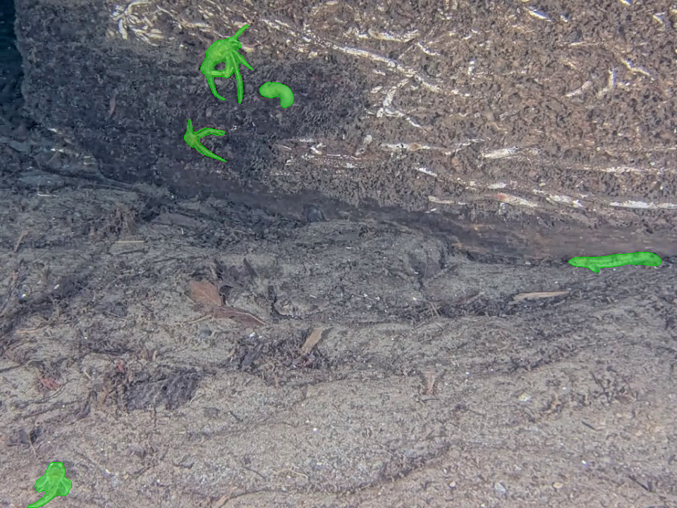

The MLLM proposed two creature groups:
- `id=1 "small fish right side"` with a positive click at (0.87, 0.37) and a *negative* click at (0.93, 0.37) — using the multi-click contract to exclude a nearby area.
- `id=2 "small worm upper center"` with a single positive click at (0.32, 0.14).

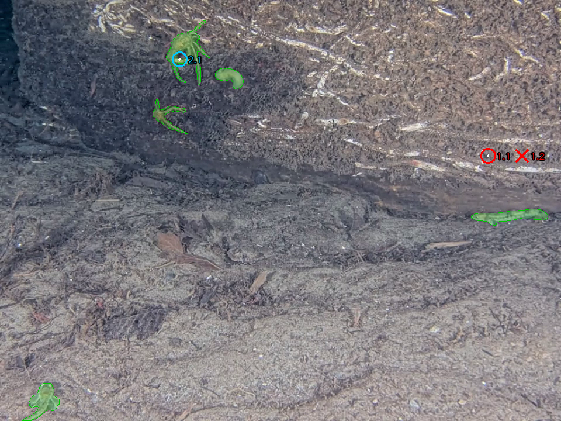

Filter decisions:
- `id=2` was **dropped pre-judge as `duplicate_of_existing`** — IoU > 0.3 with one of the existing green masks. Confirmed visually: the click sits inside an existing overlay.
- `id=1` survived the filter and went to the judge.

SAM3 produced a small focused mask for `id=1`; the judge's verdict reasoning explicitly named substrate/rock texture and rejected:

> Given that the mark appears to cover mostly substrate/rock texture rather than a clearly identifiable biological subject, and since the reference images don't confirm a persistent distinct creature at this location, I should reject this mark.

The marked candidate (note the small green region right-of-center):

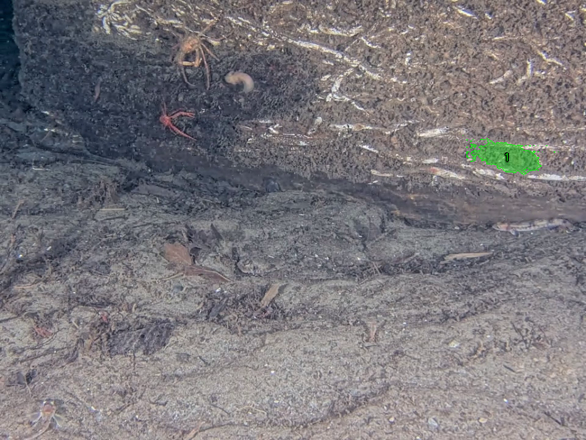

Final accepted (empty):

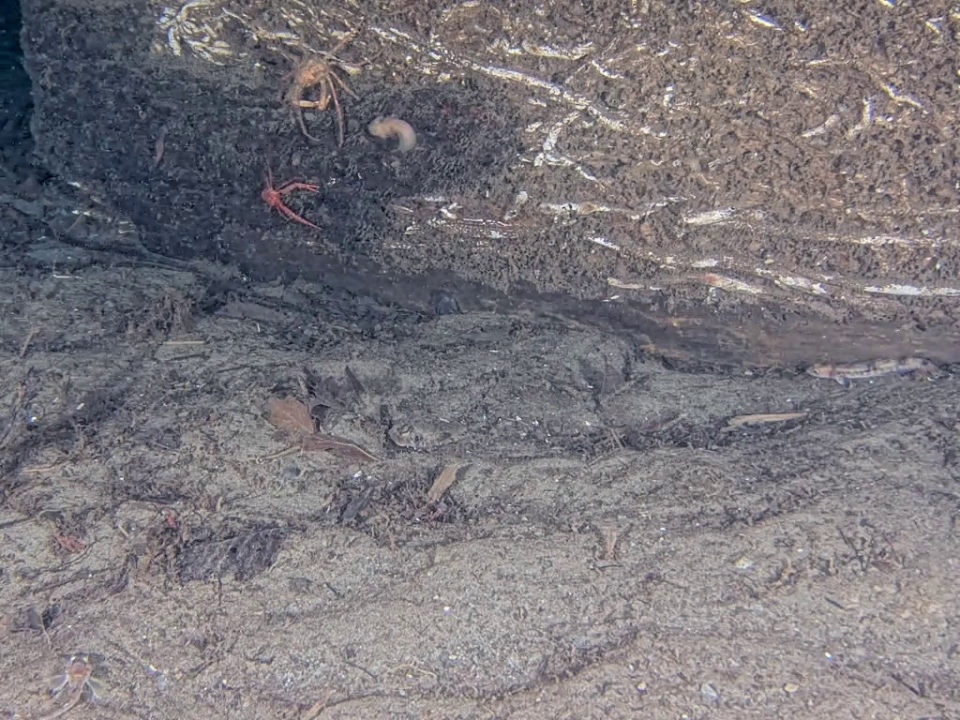

**Verdict**: judge call is defensible. The marked region is on textured rock that *could* be a small creature but isn't visually unambiguous at the available resolution. The "prefer REJECT when uncertain" rule prevented a likely false positive.

### rank01, frame 299 — judge rejected a plausible-looking fish, possibly too harsh

Text-agent had already found 4-5 fish in the upper half:

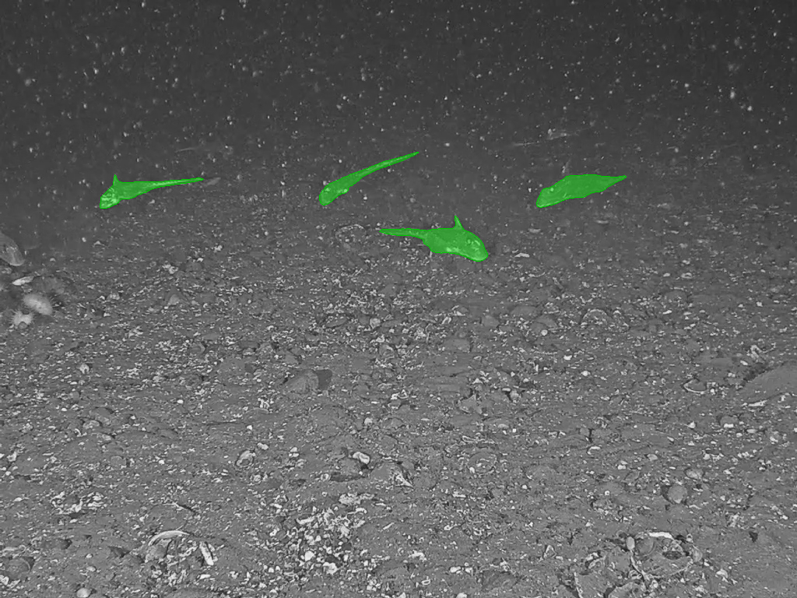

Discovery proposed one missed creature, `id=1 "small fish upper center area"`, with a single click at (0.56, 0.20):

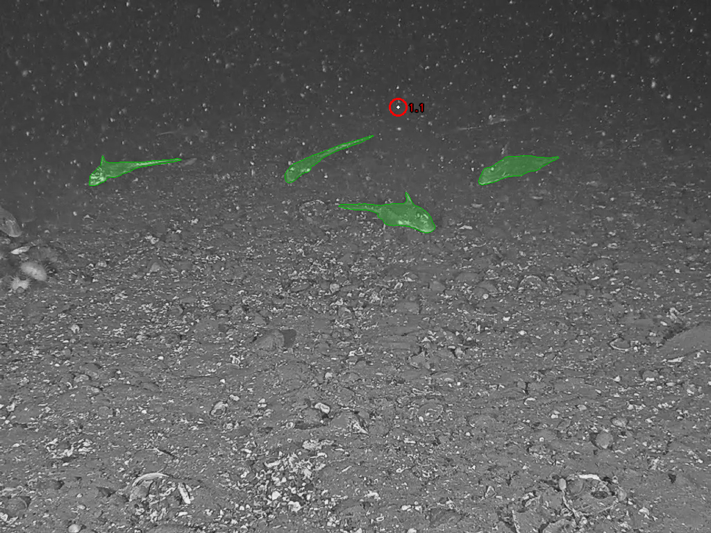

SAM3 click mode produced a small, fish-shaped mask sitting between two existing detections — the smallest-in-band selection clearly worked, the candidate is creature-scale, not substrate:

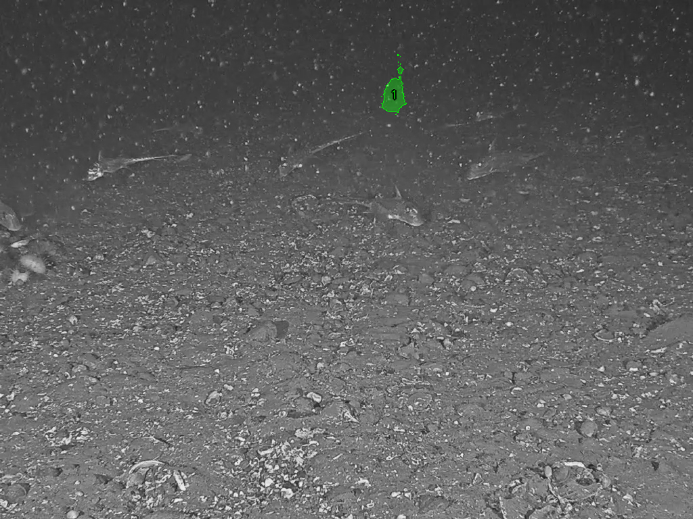

Judge response:

> However, looking more carefully, it could potentially be a small crustacean or zooplankton in the water column. But given the ambiguity and the rule that false positives hurt more than false negatives, and considering that these bright spots throughout the image appear to be marine snow rather than biological subjects with distinguishable features, I'll reject this mark.

**Verdict**: judge call is **debatable**. Looking at `04_marked.png` the mask is small and fish-shaped, sitting in a location very similar to the already-accepted fish around it. The judge fell back on "could be marine snow" — but if it's marine snow there, the four neighbouring detections would also be marine snow, and those *were* kept by the text-agent. The judge prompt's conservatism is biting here. (Final accepted shown below — also empty.)

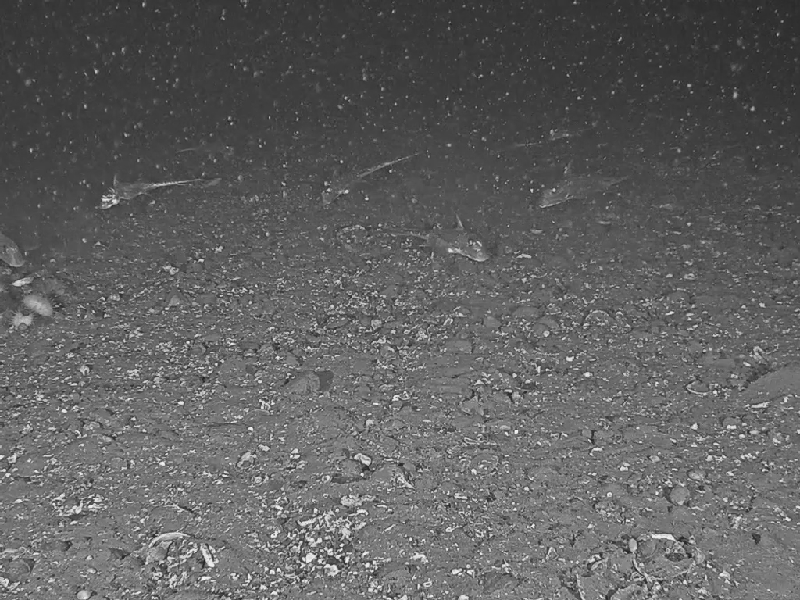

### rank02, frame 23 — judge rejected an ambiguous substrate mask

Existing text-agent masks: very sparse (text-agent under-segmented this video, median 1 mask/frame). The 02 image shows almost no green:

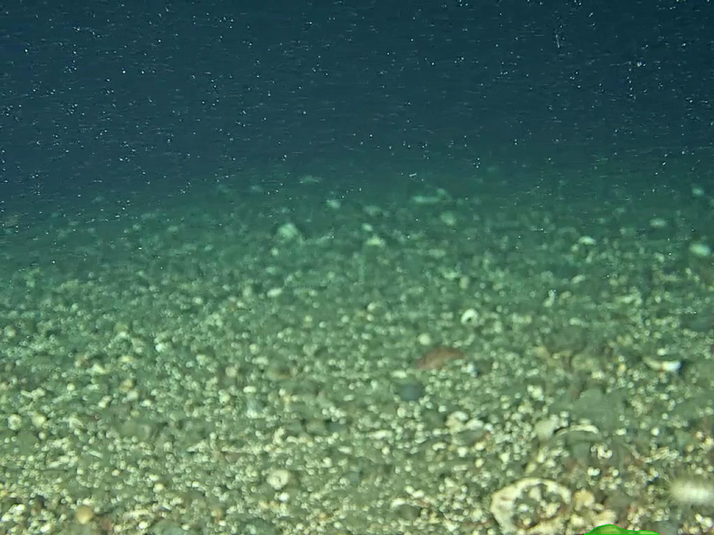

Discovery proposed two creatures:
- `id=1 "fish bottom right corner"` with two positive clicks at (0.92, 0.90) and (0.85, 0.95) — a multi-positive group anchoring an elongated fish in the corner.
- `id=2 "small creature mid-right substrate"` with one click at (0.65, 0.55).

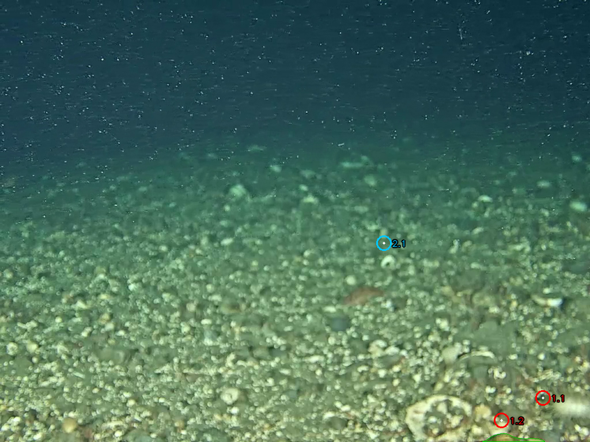

Filter decisions:
- `id=1` was **dropped pre-judge as `multi_edge_clipped`** — both positive points sit in the bottom-right corner so the resulting mask touches both bottom and right edges. The edge policy correctly prevented passing a clipped fish to the judge (which couldn't have produced a usable training-data bbox anyway).
- `id=2` survived the filter and went to the judge.

The marked candidate spans a fairly large patch of substrate:

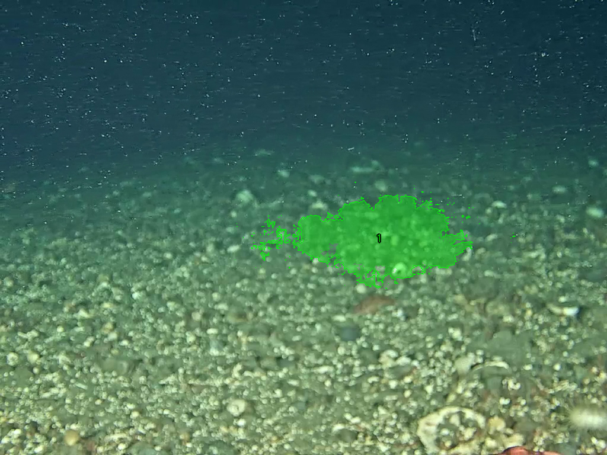

Judge response:

> Given the ambiguity and the lack of corroboration in reference frames, I'll reject this mark.

**Verdict**: judge call is defensible. The mask is large and substrate-textured. The negative point we'd have wanted (to exclude surrounding gravel) wasn't proposed by the MLLM. This is a case where evolution path **C** (per-mark refinement) could rescue it — letting the judge propose additional negative points to tighten the mask rather than just accept/reject.

### Cases where discovery found nothing (5 of 8)

| Frame | MLLM rationale (paraphrased from `discovery_response.txt`) |
|---|---|
| chinacreek f0 | Text-agent had 4 masks already. MLLM: "I don't see strong evidence of additional missed creatures." |
| rank01 f51 | Text-agent had 6 fish. MLLM: "Fish visible in references appear to correspond to already-masked creatures." |
| rank02 f299 | Text-agent had 1 fish. MLLM: "Green overlay covers it completely. Otherwise sandy/rocky substrate." |
| rank03 f0 | Text-agent found a squid; MLLM agreed it's covered. |
| rank03 f299 | MLLM identified marine snow but no creatures. Empty list. |

All five empty-discovery rationales are reasonable and the MLLM cited specific reference-frame evidence. No hallucinated "creatures" appeared in any of these.

## What worked

- **End-to-end click loop**: every component does what it should. The previous attempt was deprecated for hallucinated coords — this loop, with the structured grouped-click contract and SAM3's native click mode, produces well-formed candidates every time the MLLM proposes something.
- **Multi-point prompts**: the MLLM used the negative-point feature voluntarily on chinacreek f59 (positive on the fish, negative on the adjacent edge) and double-positive on rank02 f23 (anchor an elongated fish). The contract is usable as-is.
- **Smallest-in-band selection from SAM3's multimask output**: produced creature-scale masks (0.1%–1.8% of frame area) instead of the substrate-sized masks the highest-score selection was returning before. Confirmed by the area numbers logged at run time.
- **Pre-judge filter**: caught both the duplicate-of-existing case (chinacreek f59 worm) and the multi-edge-clipped case (rank02 f23 corner fish), saving the judge from wasted MLLM calls.
- **The conservative judge**: rejected an admittedly ambiguous substrate proposal (chinacreek f59) and an over-large substrate mask (rank02 f23). For these frames, REJECT is the correct call.

## What's brittle

- **Discovery non-determinism**: in an earlier exploratory run of chinacreek f0, the MLLM proposed two "missed crabs" that on close inspection were the same crabs the text-agent already had (the references made them look uncovered at low resolution). On the recorded run it correctly returned an empty list. The MLLM's judgment of "missed" varies by ~one click per frame between runs, which is fine when followed by the judge step but means smoke-test outcomes will not be reproducible.
- **Judge may be too conservative on plausibly-creature masks**: rank01 f299 is the clearest case — the marked region looks fish-shaped, sits among four other accepted fish, and the judge rejected it citing "could be marine snow." A more useful judge would compare the candidate to the *already-accepted* masks on the same frame (which presumably look similar) and only reject if it's *visibly different*.
- **No refinement loop yet**: rank02 f23 had a candidate that was on the right area but too large because the MLLM didn't propose a negative point. Evolution path **C** (per-mark refinement — ask the judge to propose tightening points) would help.
- **The text-agent's coverage gates everything we can fix**: in this run, 0 truly-missed creatures were both proposed AND accepted. Cases like rank01 f299 suggest *some* are being missed in the discovery phase, and the judge's harshness gates how many can reach the dataset.

## Recommendations

In rough priority order:

1. **Loosen the judge slightly when there are similar accepted masks on the same frame.** Add a prompt clause: "If the proposed mark is visually similar in scale and texture to the existing accepted masks on this frame, lean ACCEPT." This addresses rank01 f299 directly.
2. **Run with more target frames per video (K=4 or 6) on the rank02/rank03/rank04 set.** Those videos have sparse text-agent baselines, so the MLLM has more to find. K=2 picked the first and last frame on every video; the high-motion middle frames likely have more creatures.
3. **Add the per-mark refinement sub-loop (evolution path C from the spec).** When the judge says "the mark covers too much substrate," let it propose a negative point, run SAM3 again, re-judge. Iteration capped at 2 cycles per mark.
4. **Fix rank04's empty baseline before bothering with SoM.** Every frame errored in its prior text-agent run; we have nothing to dedup against. Re-run the every-frame agent on `rank04_…_t00100.mp4` to populate `frame_outputs_rle.json`.
5. **Expose `--prompt-profile underwater` MLLM judge thresholds via env var** (e.g. `SAM3_SOM_JUDGE_BIAS=permissive|conservative`) so the conservatism level can be A/B compared without recompiling system prompts.

## Outputs in the repo (this run)

- Code: commits `1e2f0a1`, `41ef5bb`, `2b42c6f`, `6f2001e`, `55624ae` on `spencer/nibi-work`
- Test suite: 105 tests, all passing
- SoM run artefacts:
    - `runs/som/chinacreekclipped/20260526_152341/`
    - `runs/som/rank01/20260526_162245/`
    - `runs/som/rank02/20260526_152438/`
    - `runs/som/rank03/20260526_152520/`
- Inspectable images for every step copied to `2026-05-26-smoke-test-v2-images/`.

## TL;DR

The loop is structurally correct and end-to-end functional with the architecture the user described. The MLLM uses the grouped-click contract well. SAM3 click mode produces creature-scale masks. The judge step is doing its job, sometimes overdoing it. Net new masks added to the dataset on this run: 0 — partly because the judge is conservative, partly because three of the four videos had thorough text-agent baselines on the frames we picked. Next iteration: relax the judge slightly, add a refinement sub-loop, run with more (and better-chosen) target frames per video.
