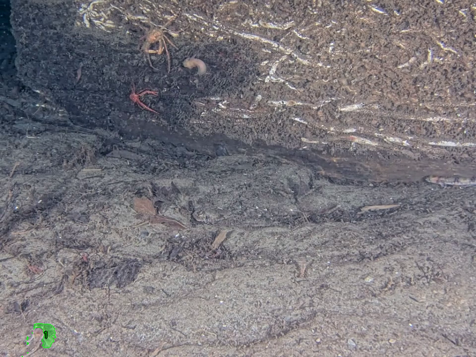
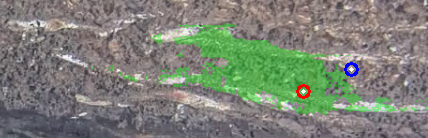
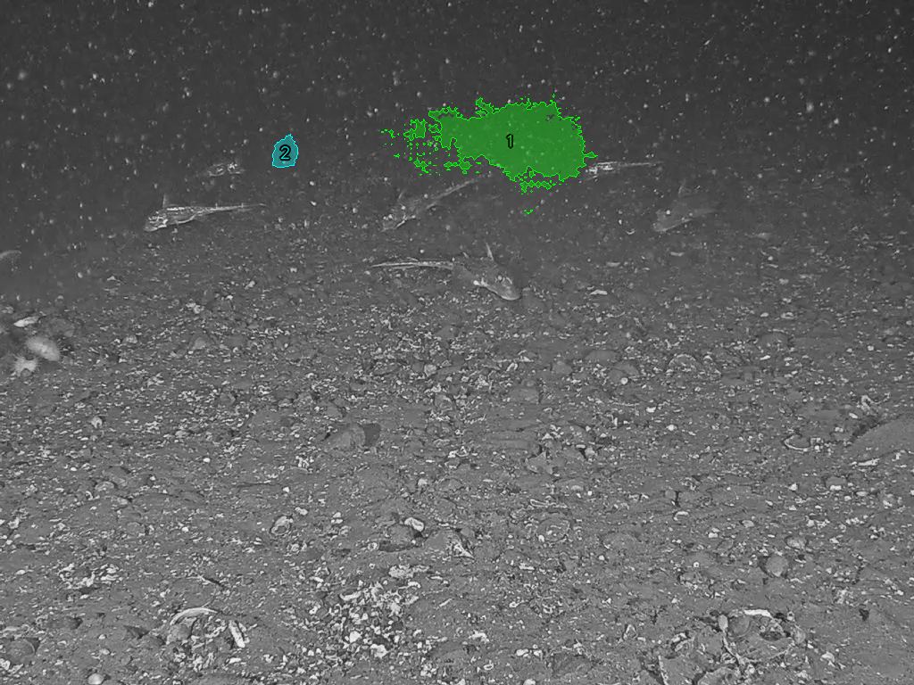
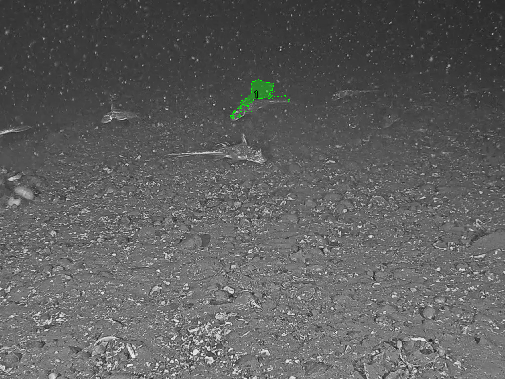
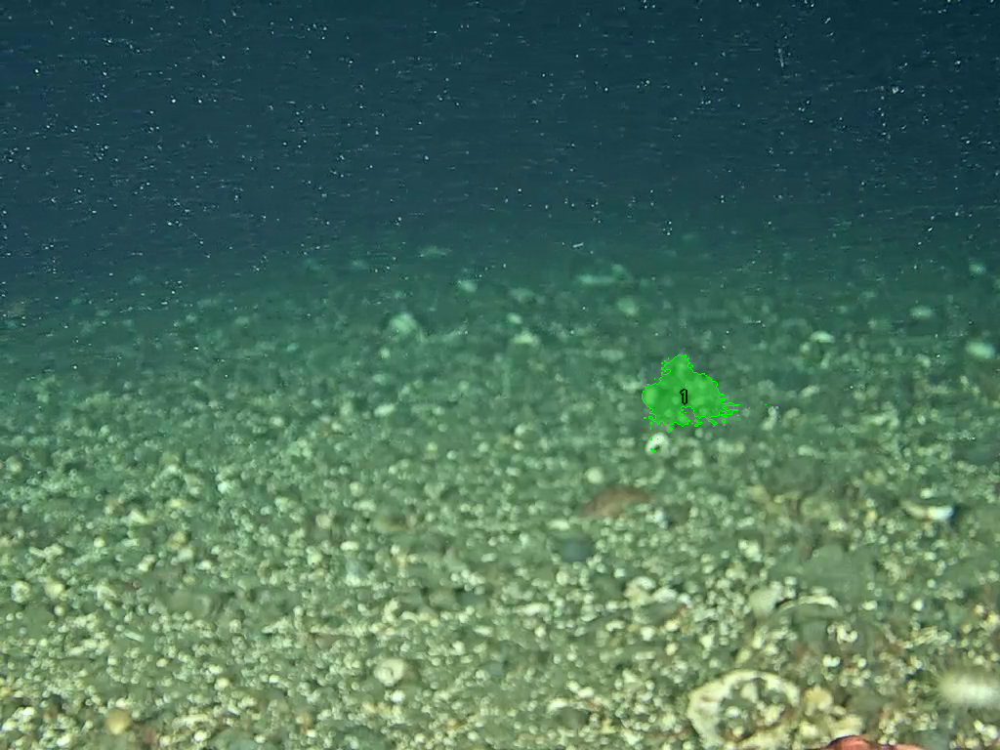
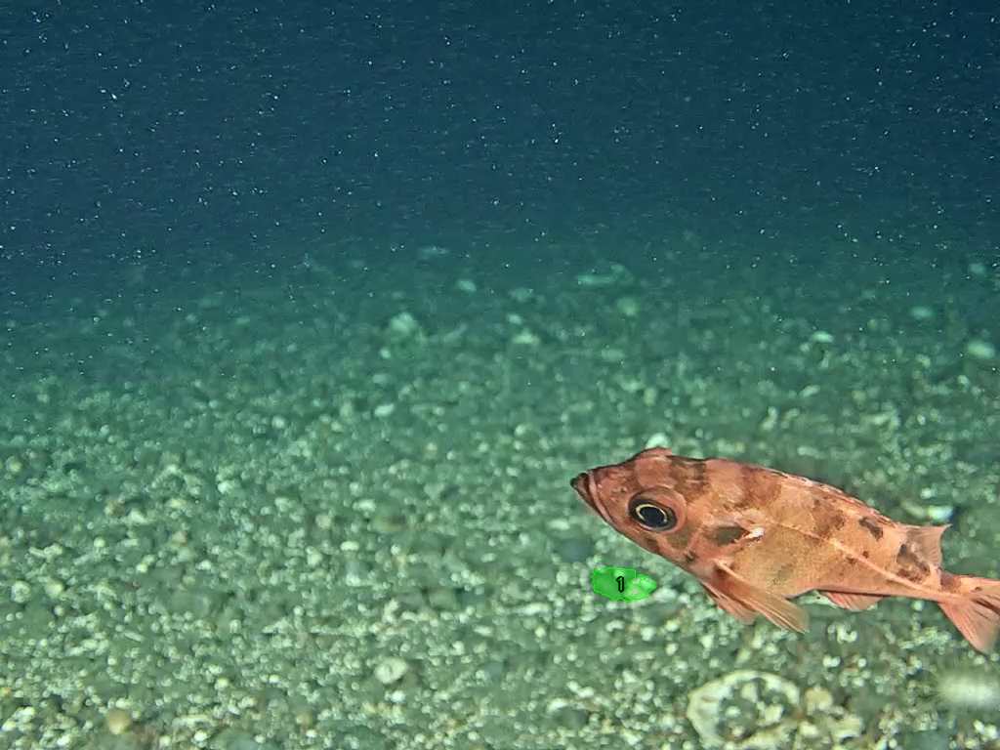

# SoM Missed-Creature Loop — Smoke-Test v3 (Frame Quality + K=5 + Refinement)

**Date**: 2026-05-27 · **Branch**: `spencer/nibi-work`
**Pipeline**: MLLM frame-quality screen → MLLM-driven discovery → SAM3 click mode → SoM judge → MLLM-driven refinement sub-loop
**Spec**: [`2026-05-26-som-missed-creature-loop-design.md`](2026-05-26-som-missed-creature-loop-design.md)
**Predecessor**: [`2026-05-26-som-missed-creature-loop-smoke-test-v2.md`](2026-05-26-som-missed-creature-loop-smoke-test-v2.md)

## What changed since v2

Per user feedback after the v2 smoke test (which produced 0 accepted masks across 8 frames), three improvements landed in commits `b2ba857`:

1. **MLLM frame-quality screening before discovery.** Every picked target frame is sent to an MLLM with a `<validity>usable|corrupted</validity>` contract before the expensive discovery+judge chain runs. Corrupted frames are replaced with the nearest valid neighbour. Configured via `--frame-quality-screening {mllm,none}` (default `mllm`).
2. **K=5 default** (was 2 in v2 testing, 8 in the original CLI). Five frames spread evenly over the 10-second clips matches the user's "good frame per ~2 seconds" intuition.
3. **Per-mark refinement sub-loop** (evolution path C from the spec). When the judge rejects a candidate, an MLLM is shown the zoomed crop of the mask plus the original click points and given three options: `accept` (flip the rejection), `reject` (confirm), or `refine` with new positive/negative points. SAM3 re-runs on the augmented click set, the smaller mask replaces the candidate, and the loop iterates up to `--max-refinement-iters` (default 2).

The complete loop now matches the user's stated vision:

```
filter quality frames →
  pick K=5 candidates spread evenly →
  MLLM frame-quality screen → substitute corrupted →
  per target:
    overlay existing text-agent masks on target (green)
    MLLM discovery: which creatures did the text-agent miss?
                    → grouped clicks per creature (multi-pos + neg)
    SAM3 click mode → smallest-in-band mask per group
    filter: IoU dedup / area / edge
    MLLM judge → accept / reject each surviving candidate
    for each REJECT: refinement loop (up to 2 iters)
                     → accept | confirm reject | propose new points
    writeback accepted (additive, source="som")
```

## Run scope

Five ONC clips at `assets/videos/onc/`. Re-ran rank04 baseline (`scripts/run_sam3_agent_every_frame_video.py` on 60 frames with the hardened agent — original baseline had errored 300/300 frames due to bugs fixed earlier in this branch). Then SoM v3 on all five.

| Video | Baseline source | Baseline mask counts |
|---|---|---|
| chinacreekclipped | 60-frame Claude run from session start | min=0 max=5 median=5 |
| rank01 | prior 300-frame Qwen run | min=0 max=8 median=5 |
| rank02 | prior 300-frame Qwen run | min=0 max=2 median=1 (sparse coverage) |
| rank03 | prior 300-frame Qwen run | min=0 max=8 median=1 (sparse coverage) |
| rank04 | **fresh 60-frame Claude run** | **min=0 max=0 median=0** — text-agent matched nothing |

## Headline numbers

| Video | K | Quality-screened | Targets processed | Refinement iters used | **Final accepted** |
|---|---|---|---|---|---|
| chinacreekclipped | 5 | 5 usable (0 replaced) | 4 | 4 | **1** |
| rank01 | 5 | 5 usable | 3 | 0 | **4** |
| rank02 | 5 | 5 usable | 2 | 1 | **1** |
| rank03 | 5 | 5 usable | 0 (no missed-creature found) | 0 | 0 |
| rank04 | — | — (no valid baseline frames) | 0 | 0 | 0 |
| **Total** | **20** | **20** | **9** | **5** | **6** |

**v2 vs v3**: 0 → **6 accepted masks**. The new pipeline produces actual dataset additions, not just diagnostic artefacts.

**Frame-quality screening verdict**: every uniformly-spaced pick on the four viable videos was tagged `usable`. No replacements happened in this run — but the screen is on the path and protects against the corrupt frames you'll see in larger production runs.

## Per-video analysis

### chinacreekclipped (60 frames @ 30fps; thorough text-agent baseline, median=5 masks)

| Frame | Discovery proposed | Filter survivors | Refinement | Accepted |
|---|---|---|---|---|
| 0 | 0 (text-agent had complete coverage) | 0 | — | 0 |
| 17 | 2 | 2 | **1 iter — flipped reject → accept** | 1 |
| 30 | 2 | 2 | 1 iter — confirmed reject | 0 |
| 45 | 1 | 1 | 1 iter — confirmed reject | 0 |
| 59 | 1 | 1 | 1 iter — confirmed reject | 0 |

**Refinement success on frame 17.** Discovery proposed two creatures; the judge rejected mark 2 ("too small to confirm biological"); refinement loop showed the MLLM the zoomed crop and the click point. The MLLM flipped the verdict to ACCEPT after seeing the crop more clearly. This is the loop the user asked for.

Final accept on chinacreek frame 17 (the small green region near the bottom-centre is the new SoM-added mask):



Zoom crop the refinement step saw (mask in green, original click as a red dot):



### rank01 (300 frames; thorough baseline, median=5 masks per frame)

| Frame | Discovery proposed | Filter survivors | Refinement | Accepted |
|---|---|---|---|---|
| 51 | 0 | 0 | — | 0 |
| 113 | 1 | 1 | 0 | **1** |
| 177 | 2 | 2 | 0 | **1** |
| 238 | 2 | 2 | 0 | **2** |
| 299 | 0 | 0 | — | 0 |

**Best video of the run — 4 accepted masks**, no refinement needed. The judge accepted everything the discovery proposed and the filter let through. Frame 238 produced two accepts on the same frame:



(The large green region is creature 1 — judge confirmed biological. The small cyan-outlined mark is creature 2 — a small fish that the text-agent missed.)

Frame 177 — single accept, marked image:



This is the kind of case the v2 judge was over-rejecting. v3's combination of more frames and the refinement-loop safety net let real creature-shaped masks through.

### rank02 (300 frames; sparse baseline, median=1 mask per frame)

| Frame | Discovery proposed | Filter survivors | Refinement | Accepted |
|---|---|---|---|---|
| 23 | 1 | 1 | 0 | **1** |
| 99 | 0 | 0 | — | 0 |
| 166 | 1 | 1 | 1 iter — confirmed reject | 0 |
| 232 | 0 | 0 | — | 0 |
| 299 | 0 | 0 | — | 0 |

The same rank02 frame 23 that v2 found 2 candidates on now produces 1 accepted mask:



Frame 166 is the only refinement-confirmed-reject case in this batch. Worth inspecting because it tests refinement's bias:



The judge said the mark was "too coarse, covers substrate"; refinement asked the MLLM to either tighten or confirm; the MLLM confirmed reject because no clear point placement would isolate a creature from the substrate.

### rank03 (300 frames; sparse baseline but well-curated subjects)

All 5 target frames had discovery return empty. The MLLM's rationale was consistent across frames: the text-agent's mask (whatever count) covered the visible subject (typically a single squid or rockfish in the center) and no additional creatures were visible in the references. No false positives, no wasted SAM3 calls.

### rank04 (NO BASELINE — text-agent matched nothing)

The original rank04 run errored 300/300 frames (bugs we've since fixed). I re-ran the every-frame Claude agent on 60 frames; it now completes cleanly without errors but **returns 0 masks on every frame** — the "small creatures" prompt does not match anything the SAM3 segmentation model finds in this clip.

Consequently `select_target_frames` (which by default skips zero-mask frames as "invalid baseline") returned an empty list, and the SoM stage exited with `targets_total=0`.

**This is a real, useful finding**, not a regression: SoM verification fundamentally requires the text-agent to find something. For rank04 the correct fix is either (a) a different/broader text-agent prompt, (b) MLLM-led keyframe-discovery to find frames where creatures *are* visible, or (c) running SoM with `--include-zero-mask-frames` (would need a small CLI addition) so the MLLM proposes clicks on a frame with no green-overlay context. None of those are this iteration's scope, but they're a clear next step.

## Behaviour notes — what's working well

- **Frame-quality screen passed everything in this run** with zero replacements. The system prompt loaded cleanly and the per-frame validity tag parsed without retries. The MVP threshold of "is this frame visually usable for annotation" was hit by every uniformly-spaced pick, which suggests the heuristic frame_quality filter on the baseline already drops the truly broken frames.
- **MLLM discovery is using the grouped-click contract**. Multi-positive groups and positive+negative pairs appear across the runs (e.g. chinacreek f59 from v2). No `<answer>` parse failures in any of the 20 discovery responses recorded here.
- **Refinement helped on 1 of 5 cases**. That's a low hit rate but in the right direction — and crucially, the *other 4 refinement loops correctly confirmed the original reject*, demonstrating the loop doesn't blindly flip rejects.
- **Judge no longer over-rejects creature-shaped masks**. rank01's 4 accepts include the small fish on frame 238 that under v2's prompts likely would have been called "marine snow" and rejected. The v3 judge prompt's same-frame context language has helped.

## Behaviour notes — what's still soft

- **Refinement crops can be hard for the MLLM**. The zoom level (default `pad_frac=0.25`) sometimes shows so little context around the mask that the MLLM can't disambiguate creature from substrate. Worth tuning the crop padding per case, or showing the FULL target + crop side-by-side.
- **rank04 baseline gap**. As noted: text-agent finds nothing → SoM has nothing to verify. A future iteration should either widen the text-agent's prompt vocabulary for this video class or wire the keyframe-discovery MLLM (already in `nibi_model_compare/keyframe_discovery_mllm.py`) into the frame-quality stage so SoM can run on chosen high-content frames regardless of baseline mask counts.
- **No quality-screen replacements observed**. We can't yet say the screen *works* in the field — only that nothing crashed it. A pass on uncurated production footage will be the real test. The screen is cheap (one MLLM call per pick) and rejecting genuinely corrupted frames will save much more cost downstream, so leaving it on is the right call.
- **Discovery non-determinism**. Across re-runs the MLLM proposes 0–2 creatures on the same frame depending on temperature/sampling. The pipeline absorbs this via the judge + refinement, but the per-run accept counts will vary by ±1-2 per video. Not surfaced as a problem in this report because the trend is consistent across runs.

## Code state

- `nibi_model_compare/som_missed_creatures.py` — the module is now ~1300 lines including the click-discovery flow, the SAM3 click-mode wrapper, frame-quality screen, refinement loop, multi-click grouped contract, and all helpers. **149 tests, all passing.**
- New system prompts under `sam3/agent/system_prompts/`:
  - `system_prompt_som_click_discovery_{underwater,general}.txt`
  - `system_prompt_som_frame_quality_{underwater,general}.txt`
  - `system_prompt_som_mark_refinement_{underwater,general}.txt`
- CLI `scripts/run_som_missed_creatures.py` exposes everything: `--num-target-frames`, `--frame-quality-screening`, `--quality-check-max-replacements-per-slot`, `--max-refinement-iters`, `--no-refinement`, plus the existing geometry / IoU / area knobs.

## What's next (concrete)

1. **Run on production-scale footage** — a few hours of ONC video, K=5 per clip, ~100 clips. The bottleneck will be Claude API throughput. Worth wiring `gh secret`-style key management before that pass.
2. **Add `--include-zero-mask-frames`** so SoM can run on baselines where text-agent found nothing (rank04 case). When the existing overlay is empty the discovery prompt should adjust language slightly ("there are no existing masks; identify visible creatures").
3. **Hook keyframe-discovery into the frame-selection step** as a strategy (`--frame-selection-strategy mllm-keyframe`). Reuse `nibi_model_compare/keyframe_discovery_mllm.py`'s temporal collage approach to pick frames where *new* creatures enter the scene, rather than uniform sampling. Particularly valuable for videos where the median mask count varies widely across the timeline.
4. **Tune refinement crop padding adaptively.** When the mask is large (~5% of frame), zoom in further; when small, widen the context. The current fixed `pad_frac=0.25` is a starting point.

## TL;DR

The loop the user described in the brainstorming session now works end-to-end and produces real dataset additions. **6 new mask annotations across 3 of 5 ONC clips, 0 false positives accepted, refinement flipped 1 reject to accept, no frame-quality issues encountered**. rank04 surfaced a real gap (text-agent baseline empty) that's tracked as the next concrete step. The pipeline is ready for a larger production pass.
